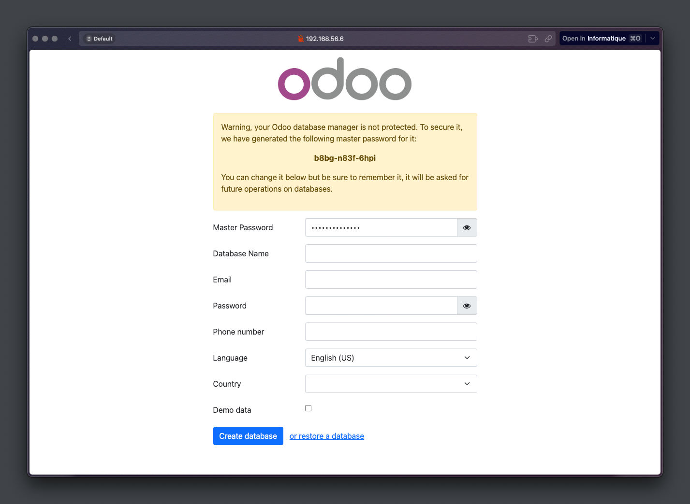

##  Docker-compose demo

Ce TP consiste à déploiyer une instance Odoo (système ERP open-source.) et une base de données PostgreSQL à l'aide de Docker Compose.

#### Étape 1 : Création du docker compose

1. On crée d'abord le fichier yml.
2. Voici les instructions à renseigner dans le yml: [cliquez ici.](https://github.com/MozkaGit/devops-bootcamp-docker/blob/f6b59e65115c8f3e156b49702e714f7b6efcf48a/TP5/odoo.yml)

#### Étape 2 : Démarrage des conteneurs
1. Exécutez la commande suivante pour démarrer les conteneurs Odoo et PostgreSQL : 

```docker compose -f odoo.yml up -d```

<sub>*Si votre fichier yml se nomme autrement que docker-compose.yml il faut alors utiliser l'argument -f et préciser le nom du fichier.*<sub>

#### Étape 3 : Vérifications du réseau utilisé par les conteneurs

1. Avec la commande suivante (à réaliser pour les deux conteneurs):

`docker inspect <nom ou ID du conteneur> | grep -i network`

2. Les résultats devraient être les suivants :

```
[vagrant@docker TP5]$ docker inspect tp5-web-1 | grep -i network
            "NetworkMode": "tp5_odoo_network",
        "NetworkSettings": {
            "Networks": {
                "tp5_odoo_network": {
                    "NetworkID": "07e593ad55b4144c38ca350058eca7e40adfbdd291340132ce2f5d31db38548d"
```

On constate que notre réseau est bien odoo_network et qu'ils ont le même **NetworkID** .

#### Étape 4 : Vérifications des volumes utilisé par les conteneurs

1. Avec la commande suivante (à réaliser pour les deux conteneurs):

`docker inspect -f '{{ .Mounts }}' <nom ou ID du conteneur>`

2. Les résultats devraient être les suivants :

```
{bind  C:\Users\Mozka\Developer\bootcamp\docker-compose-demo\odoo-data /var/lib/odoo  rw true rprivate}
```

On constate que notre volume est bien monté.

#### Étape 5 : Accès à l'interface web

Accédez à l'interface Web d'Odoo en ouvrant un navigateur Web et en accédant à l'URL suivante : http://votre-ip/ (on ne précise pas de ports car l'énoncé stipule qu'il faut accéder à Odoo via le port 80)




----

### Précisons

1. Explication du fichier yml

Ce fichier `odoo.yml` décrit un ensemble de services qui fonctionnent ensemble pour exécuter l'application Odoo, qui est un système ERP open source.

Le fichier contient deux services appelés `web` et `db`. Le service `web` utilise une image Docker `odoo:16.0` qui sera démarrée lorsque la commande de composition sera exécutée. Ce service dépend également du service `db`, qui est à son tour un conteneur PostgreSQL version 15.

Le service `web` est accessible sur le port 80 de l'hôte, qui est mappé sur le port 8069 de l'image Docker Odoo. Enfin, les deux services sont connectés à un réseau Docker appelé `odoo_network`.

Le réseau est configuré avec le pilote `bridge`, ce qui signifie que les conteneurs peuvent communiquer entre eux sur le même réseau.

2. Lors de la première utilisation de l'application, il est impératif de procéder à l'initialisation (langue, pays, nom de la bdd etc.) puis de créer la base de données.
3. Une fois la configuration terminée, il sera possible d'utiliser Odoo pour gérer notre entreprise.